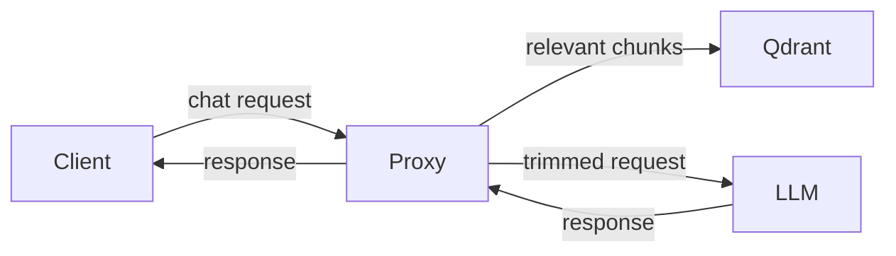

# ContextCut-PRO

**Stop wasting tokens. Inject only what matters.**

ContextCut-PRO is a transparent semantic RAG proxy that drops in front of any LLM — Ollama, OpenAI, OpenRouter, or any OpenAI-compatible endpoint. Zero application changes. It intercepts each request, finds the relevant chunks from your knowledge base, and injects only what scores above your threshold. If nothing is relevant, it injects nothing — saving you 50–90% on tokens.


*Split-panel dashboard: live token analytics, per-request breakdown, integrated streaming chat, model selector.*

---

## How it works



1. Your existing LLM client sends a request to ContextCut (port 18788)
2. ContextCut vector-searches your knowledge base in Qdrant
3. Only chunks scoring above `MIN_SCORE` are injected into the prompt
4. Request is forwarded to your LLM — response streams back through the dashboard

**Zero code changes.** Just point your client at `http://localhost:18788/v1/chat/completions` instead of your LLM.

---

## Token savings — real numbers

| Query | Without ContextCut | With ContextCut |
|---|---|---|
| "What are the guardrails?" | 3,000+ tokens (all docs) | 806 tokens (1 relevant chunk) |
| "Explain quantum physics" | 3,000+ tokens (junk) | ~5 tokens (nothing relevant — skipped) |

**50–90% reduction on real workloads.** The dashboard shows every request with before/after token counts and relevance scores.

---

## Features

| Feature | ContextCut-PRO |
|---|---|
| Transparent RAG proxy | ✅ Drop-in, zero code changes |
| Semantic search | ✅ Qdrant + Voyage AI or Ollama embeddings |
| Smart injection | ✅ Only injects when relevant (MIN_SCORE threshold) |
| Real-time dashboard | ✅ Split-panel: token analytics + streaming chat |
| Per-request breakdown | ✅ Before/after tokens, CTX%, relevance hits per query |
| Session history | ✅ SQLite persistence with searchable archive |
| File watcher | ✅ Auto-ingest `.md` files on change |
| Live context bar | ✅ Visual CTX% usage with real-time updates |
| Model selector | ✅ Quick-switch between Ollama / cloud models |
| Multi-provider | ✅ Ollama, OpenAI, OpenRouter, Custom |
| Embedding backend | ✅ Local (Ollama) or cloud (Voyage AI) |
| One-liner install | ✅ macOS launchd / Linux systemd + start.sh |
| Qdrant auto-install | ✅ Installed by installer if not found |

---

## Alternatives comparison

| | ContextCut-PRO | Odysseus | OpenAI Assistants | DIY RAG |
|---|---|---|---|---|
| **What it is** | RAG proxy | Full AI workspace | Cloud RAG API | Manual implementation |
| **Setup time** | 30 seconds | ~5 minutes | Minutes | Days–weeks |
| **App changes** | None (proxy) | Replace your client | Replace your client | Full integration |
| **Privacy** | 100% local | Mostly local | Cloud-only | Depends on setup |
| **Token analytics** | Live dashboard | None | View via API | Build yourself |
| **Chat history** | SQLite + search | Built-in | Platform history | Build yourself |
| **Resource footprint** | 1 Python process | Multi-container (Chroma, SearXNG, ntfy, ...) | Nothing local | Varies |
| **Cost** | $99.88 one-time | Free (MIT) | Usage-based | Free |
| **Knowledge base** | Auto-ingest `.md` files | Manual upload | File upload API | Manual pipeline |

**ContextCut-PRO fits the niche between "free DIY" and "heavy workspace" — a single-purpose tool that does one thing well with zero friction.**

---

## Requirements

- Python 3.10+
- [Voyage AI API key](https://dash.voyageai.com) (free tier works) — or use local Ollama embeddings
- [Qdrant](https://qdrant.tech) (auto-installed by the installer if not found)
- Ollama or any OpenAI-compatible LLM endpoint
- Valid PRO license key (delivered via email at purchase)

---

## Install

### One-command (from purchase email)

```bash
curl -fsSL "https://api.contextcut-pro.com/install/CC-PRO-your-key-here" | bash
```

### Manual

```bash
curl -fsSL https://raw.githubusercontent.com/StevoKeano/ContextCut-PRO/main/install.sh -o /tmp/cc-install.sh
chmod +x /tmp/cc-install.sh
bash /tmp/cc-install.sh
```

On macOS, services start automatically on login (launchd). On Linux, a `start.sh` script is generated along with an optional systemd user service for reboot-proof operation.

---

## Quick start after install

```bash
# 1. Copy knowledge files
cp ~/contextcut/starterKnowledgeFiles/base-* ~/contextcut/knowledge/

# 2. Point your LLM client at the proxy
#    (instead of http://localhost:11434/v1, use http://localhost:18788/v1)

# 3. Open the dashboard
open http://localhost:18787
```

---

## Configuration

| Variable | Default | Description |
|---|---|---|
| `VOYAGE_API_KEY` | _(required)_ | Voyage AI API key (blank = local Ollama embeddings) |
| `CONTEXTCUT_UPSTREAM` | `http://localhost:11434` | Ollama or OpenAI-compatible endpoint |
| `CONTEXTCUT_QDRANT_HOST` | `localhost` | Qdrant host |
| `CONTEXTCUT_QDRANT_PORT` | `6333` | Qdrant port |
| `CONTEXTCUT_COLLECTION` | `contextcut` | Qdrant collection name |
| `CONTEXTCUT_KB_DIR` | `~/contextcut/knowledge` | Knowledge base directory |
| `CONTEXTCUT_PROXY_PORT` | `18788` | Proxy listen port |
| `CONTEXTCUT_DASHBOARD_PORT` | `18787` | Dashboard port |
| `CONTEXTCUT_CTX_LIMIT` | `32768` | Model context window |
| `CONTEXTCUT_TOP_K` | `5` | Max chunks to retrieve |
| `CONTEXTCUT_MIN_SCORE` | `0.50` | Minimum relevance threshold |
| `CONTEXTCUT_MODEL` | `qwen3:14b-q8_0` | Default model in dashboard |

---

## Dashboard

Open `http://localhost:18787`:

- **Left panel** — License status, request count, token savings, CTX% usage bar, per-request table with relevance scores and source hits. Auto-refreshes.
- **Right panel** — Streaming chat with model selector dropdown. Type a message, see the injection decisions in real time.
- **History modal** — Searchable archive of past sessions stored in SQLite.

---

## Tuning MIN_SCORE

```bash
python ingest.py --query "your typical query"
```

- Above `0.35` — highly relevant, inject
- `0.20–0.35` — tangentially related, use with caution
- Below `0.20` — noise, skip

Start at `0.30` and adjust for your domain.

---

---

## ContextCut-Free

**One file, no Docker, no license, no API keys.** A lightweight version of ContextCut for local-only use.

| | Free | PRO |
|---|---|---|
| **Vector DB** | FAISS (local, no server) | Qdrant (server-grade) |
| **File limit** | 50 files | Unlimited |
| **Embedding** | Ollama only | Voyage AI + Ollama |
| **Web search** | DuckDuckGo (free) | DuckDuckGo + API key providers |
| **Dashboard** | Minimal | Real-time token analytics, per-request breakdown |
| **File watcher** | — | Auto-ingest on create / move / delete |
| **Cloud providers** | Ollama only | OpenAI, OpenRouter, Anthropic, xAI, Custom |
| **Starter templates** | — | 60+ domain-specific knowledge files |
| **License** | None required | $99.88 one-time |

### Install Free

One command — requires Python 3, Ollama, and `nomic-embed-text` / `qwen2.5:7b` pulled:

```bash
curl -sSf https://raw.githubusercontent.com/StevoKeano/ContextCut-PRO/main/install-free.sh | bash -s -- --host localhost --port 11434
```

Or visit the [landing page](https://contextcut-free.ppsel03.workers.dev) to customize settings and copy the command.

### Quick start

```bash
# 1. Open the dashboard
open http://localhost:18788

# 2. Upload .md files via the 📎 button (50 file limit)
# 3. Toggle 🌐 Search for live web results
# 4. Start chatting — context is injected automatically
```

Ideal for:
- **Evaluating** ContextCut before buying PRO
- **Personal use** on a single machine with local models
- **Air-gapped environments** with no cloud access

---

## License

**Pro License – $99.88 one-time per seat**

ContextCut PRO is proprietary software. Purchase grants a single-seat commercial license. See [LICENSE.md](LICENSE.md) for full terms.

- Lifetime commercial usage rights
- Priority support
- Advanced context-cutting rules & presets
- Pro dashboard features

[Buy Pro License →](https://5984630877416.gumroad.com/l/ContextCut-Pro)
