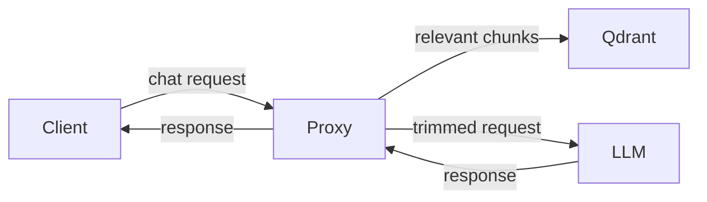

# ContextCut-PRO

**Stop wasting tokens. Inject only what matters.**

ContextCut-PRO is a transparent semantic RAG proxy that drops in front of any LLM — Ollama, OpenAI, OpenRouter, or any OpenAI-compatible endpoint. Zero application changes. It intercepts each request, finds the relevant chunks from your knowledge base, and injects only what scores above your threshold. If nothing is relevant, it injects nothing — saving you 50–90% on tokens.


*Split-panel dashboard: live token analytics, per-request breakdown, integrated streaming chat, model selector.*

---

## How it works



1. Your existing LLM client sends a request to ContextCut (port 18788)
2. ContextCut vector-searches your knowledge base in Qdrant
3. Only chunks scoring above `MIN_SCORE` are injected into the prompt
4. Request is forwarded to your LLM — response streams back through the dashboard

**Zero code changes.** Just point your client at `http://localhost:18788/v1/chat/completions` instead of your LLM.

---

## Token savings — real numbers

| Query | Without ContextCut | With ContextCut |
|---|---|---|
| "What are the guardrails?" | 3,000+ tokens (all docs) | 806 tokens (1 relevant chunk) |
| "Explain quantum physics" | 3,000+ tokens (junk) | ~5 tokens (nothing relevant — skipped) |

**50–90% reduction on real workloads.** The dashboard shows every request with before/after token counts and relevance scores.

---

## Features

| Feature | ContextCut-PRO |
|---|---|
| Transparent RAG proxy | ✅ Drop-in, zero code changes |
| Semantic search | ✅ Qdrant + Voyage AI or Ollama embeddings |
| Smart injection | ✅ Only injects when relevant (MIN_SCORE threshold) |
| Real-time dashboard | ✅ Split-panel: token analytics + streaming chat |
| Per-request breakdown | ✅ Before/after tokens, CTX%, relevance hits per query |
| Session history | ✅ SQLite persistence with searchable archive |
| File watcher | ✅ Auto-ingest `.md` files on change |
| Live context bar | ✅ Visual CTX% usage with real-time updates |
| Model selector | ✅ Quick-switch between Ollama / cloud models |
| Multi-provider | ✅ Ollama, OpenAI, OpenRouter, Custom |
| MCP Knowledge Server | ✅ Expose KB via Model Context Protocol |
| Embedding backend | ✅ Local (Ollama) or cloud (Voyage AI) |
| One-liner install | ✅ macOS launchd / Linux systemd + start.sh |
| Qdrant auto-install | ✅ Installed by installer if not found |

### Dashboard Controls

Five controls affect how the proxy responds:

| Control | Options | Description |
|---|---|---|
| **Scan ON/OFF** | Toggle button | Enables confidence scanning of responses. After each assistant reply, a secondary LLM evaluates factual claims and highlights suspect passages inline. When ON with Agent mode, enables automatic self-correction on LOW-confidence responses |
| **DEEP** | Checkbox | Uses sub-agent verifier harness with Qdrant KB search for evidence-backed fact-checking, instead of a single LLM pass. Requires Scan ON. Disables the self-correction loop |
| **Agent ON/OFF** | Toggle button | Enables tool-use mode — agent can run shell commands, read/write files, search the KB |
| **Unattended** | Checkbox | Auto-approves shell commands the agent wants to run, skipping the Allow/Deny prompt |
| **Model** | Text input | The model name to use (e.g. `qwen3:14b-q8_0`, `deepseek-v4-pro:cloud`) |

Agent ON and DEEP are independent — any combination works, from simple chat (both OFF) to verified agent (both ON).

---

## Alternatives comparison

| | ContextCut-PRO | Odysseus | OpenAI Assistants | DIY RAG |
|---|---|---|---|---|
| **What it is** | RAG proxy | Full AI workspace | Cloud RAG API | Manual implementation |
| **Setup time** | 30 seconds | ~5 minutes | Minutes | Days–weeks |
| **App changes** | None (proxy) | Replace your client | Replace your client | Full integration |
| **Privacy** | 100% local | Mostly local | Cloud-only | Depends on setup |
| **Token analytics** | Live dashboard | None | View via API | Build yourself |
| **Chat history** | SQLite + search | Built-in | Platform history | Build yourself |
| **Resource footprint** | 1 Python process | Multi-container (Chroma, SearXNG, ntfy, ...) | Nothing local | Varies |
| **Cost** | $99.88 one-time | Free (MIT) | Usage-based | Free |
| **Knowledge base** | Auto-ingest `.md` files | Manual upload | File upload API | Manual pipeline |

**ContextCut-PRO fits the niche between "free DIY" and "heavy workspace" — a single-purpose tool that does one thing well with zero friction.**

---

## Requirements

- Python 3.10+
- [Voyage AI API key](https://dash.voyageai.com) (free tier works) — or use local Ollama embeddings
- [Qdrant](https://qdrant.tech) (auto-installed by the installer if not found)
- Ollama or any OpenAI-compatible LLM endpoint
- Valid PRO license key (delivered via email at purchase)

---

## Install

### One-command (from purchase email)

```bash
curl -fsSL "https://api.contextcut-pro.com/install/CC-PRO-your-key-here" | bash
```

### Manual

```bash
curl -fsSL https://raw.githubusercontent.com/StevoKeano/ContextCut-PRO/main/install.sh -o /tmp/cc-install.sh
chmod +x /tmp/cc-install.sh
bash /tmp/cc-install.sh
```

On macOS, services start automatically on login (launchd). On Linux, a `start.sh` script is generated along with an optional systemd user service for reboot-proof operation.

---

## Quick start after install

```bash
# 1. Copy knowledge files
cp ~/contextcut/starterKnowledgeFiles/base-* ~/contextcut/knowledge/

# 2. Point your LLM client at the proxy
#    (instead of http://localhost:11434/v1, use http://localhost:18788/v1)

# 3. Open the dashboard
open http://localhost:18787
```

---

## Configuration

| Variable | Default | Description |
|---|---|---|
| `VOYAGE_API_KEY` | _(required)_ | Voyage AI API key (blank = local Ollama embeddings) |
| `CONTEXTCUT_UPSTREAM` | `http://localhost:11434` | Ollama or OpenAI-compatible endpoint |
| `CONTEXTCUT_QDRANT_HOST` | `localhost` | Qdrant host |
| `CONTEXTCUT_QDRANT_PORT` | `6333` | Qdrant port |
| `CONTEXTCUT_COLLECTION` | `contextcut` | Qdrant collection name |
| `CONTEXTCUT_KB_DIR` | `~/contextcut/knowledge` | Knowledge base directory |
| `CONTEXTCUT_PROXY_PORT` | `18788` | Proxy listen port |
| `CONTEXTCUT_DASHBOARD_PORT` | `18787` | Dashboard port |
| `CONTEXTCUT_CTX_LIMIT` | `32768` | Model context window |
| `CONTEXTCUT_TOP_K` | `5` | Max chunks to retrieve |
| `CONTEXTCUT_MIN_SCORE` | `0.50` | Minimum relevance threshold |
| `CONTEXTCUT_MODEL` | `qwen3:14b-q8_0` | Default model in dashboard |
| `CONTEXTCUT_SCAN_MODEL` | *(unset)* | Separate model for backend confidence scan. Must differ from agent model. E.g. `qwen3:4b` |

---

## Dashboard

Open `http://localhost:18787`:

- **Left panel** — License status, request count, token savings, CTX% usage bar, per-request table with relevance scores and source hits. Auto-refreshes.
- **Right panel** — Streaming chat with model selector dropdown. Type a message, see the injection decisions in real time.
- **History modal** — Searchable archive of past sessions stored in SQLite.

---

## Tuning MIN_SCORE

```bash
python ingest.py --query "your typical query"
```

- Above `0.35` — highly relevant, inject
- `0.20–0.35` — tangentially related, use with caution
- Below `0.20` — noise, skip

Start at `0.30` and adjust for your domain.

---

---

## MCP Knowledge Server

Expose your knowledge base via the [Model Context Protocol](https://modelcontextprotocol.io) — usable from Claude Desktop, Cursor, VS Code, and any MCP client.

### Start

```bash
python mcp_knowledge_server.py                        # stdio transport
python mcp_knowledge_server.py --transport http        # Streamable HTTP (default: port 8910)
python mcp_knowledge_server.py --transport http --port 8910
```

The `start.sh` script starts the MCP server automatically with `--transport http --port ${CONTEXTCUT_MCP_PORT:-8910}`.

### Client Configuration

**Claude Desktop** (`~/Library/Application Support/Claude/claude_desktop_config.json`):

```json
{
  "mcpServers": {
    "contextcut": {
      "command": "python",
      "args": ["/home/user/contextcut/mcp_knowledge_server.py"],
      "env": {
        "CONTEXTCUT_QDRANT_HOST": "localhost",
        "CONTEXTCUT_QDRANT_PORT": "6333",
        "CONTEXTCUT_COLLECTION": "contextcut",
        "CONTEXTCUT_KB_DIR": "/home/user/contextcut/knowledge"
      }
    }
  }
}
```

**Cursor** → Settings → MCP → Add server:

| Field | Value |
|---|---|
| Name | `contextcut` |
| Type | `command` |
| Command | `python /home/user/contextcut/mcp_knowledge_server.py` |

**VS Code** (via [Claude Dev](https://marketplace.visualstudio.com/items?itemName=saoudrizwan.claude-dev) or similar MCP extensions):

```json
{
  "mcpServers": {
    "contextcut": {
      "command": "python",
      "args": ["/home/user/contextcut/mcp_knowledge_server.py"]
    }
  }
}
```

**Any HTTP client** (when running with `--transport http`):

```bash
# List files in knowledge base
curl http://localhost:8910/knowledge://files

# Search knowledge base
curl "http://localhost:8910/knowledge://search/your%20query"

# Get stats
curl http://localhost:8910/knowledge://stats
```

### Tools Available

| Tool | Description |
|---|---|
| `knowledge_search` | Search KB with a query string, returns ranked chunks |
| `knowledge_search_structured` | Search with JSON schema (top_k, min_score, collection) |
| `knowledge_list_files` | List all indexed source files |
| `knowledge_stats` | Get KB stats (total chunks, collections, files) |
| `ingest_file` | Ingest a single file into the KB |
| `ingest_all` | Re-ingest all files from the KB directory |
| `ingest_status` | Check if the watcher is currently ingesting |

---

## Agent Tools

ContextCut-PRO's agent tools (in agent_handler.py) are fundamentally different from cloud-based tool-calling services like Hermes hosted on some platform:

**ContextCut-PRO agent tools** — 100% local, zero per-call cost. Tools like knowledge_search, web_search, read_file, calculate, etc. run on your own machine. There's no metering, no credits, no API fees — ever.

**Cloud Hermes tool calls** — a hosted model that can call functions. The "$1 free credits" is a platform offering access to a Hermes model that supports function-calling, charging per tool call.

They're orthogonal: you could point ContextCut-PRO's proxy at a Hermes model running locally via Ollama and get both the RAG context injection layer and Hermes' native tool-calling in one request. The agent system (agent_handler.py) just adds LangChain-powered multi-tool orchestration on top — knowledge base search, file reads, calculator, DuckDuckGo — all local, no token-metered tool calls.

Yes, it's fully dynamic. Three tools enable runtime code generation:

- `run_python(code)` — the LLM can write and execute arbitrary Python in a subprocess. Capable of importing libraries, processing data, generating output, anything.
- `shell_exec(command)` — the LLM can run bash commands.
- `compose_tool(name, description, steps)` — the LLM can dynamically chain existing tools into new compound tools, then call them by name on subsequent turns.

So the agent isn't limited to a fixed tool list. The LLM can generate Python at runtime to solve problems — data analysis, scripting, API calls, whatever it needs.

In short: ContextCut-PRO is the proxy + RAG layer you put in front of any model (Hermes, Qwen, Llama, etc.). The "free tool credits" thing is a separate cloud billing model that doesn't apply here.

---

## Scan & DEEP Modes

The dashboard provides two response-verification controls: **Scan ON/OFF** and **DEEP**. They work together or independently.

### Scan ON/OFF — Confidence Scan

After every assistant response (agent or plain chat), the text is POSTed to `/api/agent/confidence-scan`. A secondary LLM call evaluates each factual claim as **correct / uncertain / incorrect**. Suspect passages are highlighted inline in the chat bubble with a summary bar.

| Feature | Scan ON |
|---|---|
| Speed | ~seconds |
| Dependencies | None |
| Evidence-backed | No |
| Self-correction loop | ✅ (agent mode only) |
| Best for | Daily use, rapid iteration |

**How it works:**

1. **Frontend** — After the response finishes, `runScan()` sends the text to `/api/agent/confidence-scan`.
2. **Backend** — `_confidence_scan()` calls the scan model (or the agent model as fallback) with `temperature=0.0` and a detailed prompt that asks for a JSON array of passages with `text`, `factual` (correct/incorrect/uncertain), and `reason`.
3. **Highlighting** — The frontend injects `<span class="suspect">` tags at the character offsets returned by the backend and appends a summary bar: `✓ N correct | ⚡ N uncertain | ⚠️ N incorrect`.
4. **Self-correction loop** — In agent mode, if the backend finds LOW-confidence passages (simple HIGH/MEDIUM/LOW check), the agent receives a correction prompt and one retry. This is **disabled** when DEEP is on.

**Scan model:** Set `CONTEXTCUT_SCAN_MODEL` to a different, smaller model (e.g. `qwen3:4b` or `llama3.2:1b-instruct-q4_K_M`) to avoid self-evaluation. If unset, the chat model is used and a yellow warning is shown: *"Self-evaluating (no separate scan model)."*

```bash
# .env
CONTEXTCUT_SCAN_MODEL=qwen3:4b
```

### DEEP — Sub-Agent Verifier

Replaces the simple LLM scan with a **sub-agent harness** (`_deep_confidence_scan()`) that spawns parallel workers to check each factual claim against your Qdrant knowledge base. Each claim gets evidence search → source-backed verdict.

| Feature | DEEP |
|---|---|
| Speed | 10–120s |
| Dependencies | `pip install deepagents` |
| Evidence-backed | ✅ (Qdrant KB citations) |
| Self-correction loop | ❌ |
| Best for | Critical responses (medical, legal, security) |

**How it works:**

1. Creates a `verifier` agent via `create_deep_agent()` from the `deepagents` package.
2. The verifier has one tool: `search_knowledge_base(query)` — which searches Qdrant for supporting or contradicting evidence.
3. The verifier parses the text into individual factual claims, spawns parallel sub-agents for independent claims, and returns a JSON array with `text`, `factual`, `reason`, and `source_url`.
4. Runs with a 120-second timeout. Falls back gracefully if `deepagents` is not installed.

### Practical Guidance

| Scenario | Scan | DEEP | Why |
|---|---|---|---|
| Daily chat, quick iteration | OFF | OFF | Max throughput, no overhead |
| Lightweight hallucination check | ON | OFF | Fast single-LLM check, self-correction loop active |
| Critical response with sources | ON | ON | Sub-agent verification against your KB |
| Debugging or testing prompts | OFF | OFF | No post-processing, see raw output |
| Security audit / pentest results | ON | ON | Verifiable claims with evidence from KB |

### Two scan modes (detailed vs simple)

| | Frontend (🧪 Scan ON) | Backend (self-correction) |
|---|---|---|
| **Model** | Scan model or fallback to agent model | `CONTEXTCUT_SCAN_MODEL` |
| **Prompt** | Detailed — returns passages with `"text"`, `"factual"`, `"reason"` | Simple — single-word rating: HIGH/MEDIUM/LOW |
| **Purpose** | Visual highlighting for the user | Automated correction loop |
| **Trigger** | Frontend calls `/api/agent/confidence-scan` | Runs inside `_run_agent_stream` / `_run_agent` |

### Configuration

| Variable | Default | Description |
|---|---|---|
| `CONTEXTCUT_SCAN_MODEL` | *(unset)* | Separate model for scanning. Must differ from agent model. E.g. `qwen3:4b` |
| `CONTEXTCUT_MODEL` | `qwen3:14b-q8_0` | Agent / chat model, fallback for scanning |

---

## ContextCut-Free

**One file, no Docker, no license, no API keys.** A lightweight version of ContextCut for local-only use.

| | Free | PRO |
|---|---|---|
| **Vector DB** | FAISS (local, no server) | Qdrant (server-grade) |
| **File limit** | 50 files | Unlimited |
| **Embedding** | Ollama only | Voyage AI + Ollama |
| **Web search** | DuckDuckGo (free) | DuckDuckGo + API key providers |
| **Dashboard** | Minimal | Real-time token analytics, per-request breakdown |
| **File watcher** | — | Auto-ingest on create / move / delete |
| **Cloud providers** | Ollama only | OpenAI, OpenRouter, Anthropic, xAI, Custom |
| **Starter templates** | — | 60+ domain-specific knowledge files |
| **License** | None required | $99.88 one-time |

### Install Free

One command — requires Python 3, Ollama, and `nomic-embed-text` / `qwen2.5:7b` pulled:

```bash
curl -sSf https://raw.githubusercontent.com/StevoKeano/ContextCut-PRO/main/install-free.sh | bash -s -- --host localhost --port 11434
```

Or visit the [landing page](https://contextcut-free.ppsel03.workers.dev) to customize settings and copy the command.

### Quick start

```bash
# 1. Open the dashboard
open http://localhost:18788

# 2. Upload .md files via the 📎 button (50 file limit)
# 3. Toggle 🌐 Search for live web results
# 4. Start chatting — context is injected automatically
```

Ideal for:
- **Evaluating** ContextCut before buying PRO
- **Personal use** on a single machine with local models
- **Air-gapped environments** with no cloud access

---

## License

**Pro License – $99.88 one-time per seat**

ContextCut PRO is proprietary software. Purchase grants a single-seat commercial license. See [LICENSE.md](LICENSE.md) for full terms.

- Lifetime commercial usage rights
- Priority support
- Advanced context-cutting rules & presets
- Pro dashboard features

[Buy Pro License →](https://5984630877416.gumroad.com/l/ContextCut-Pro)
