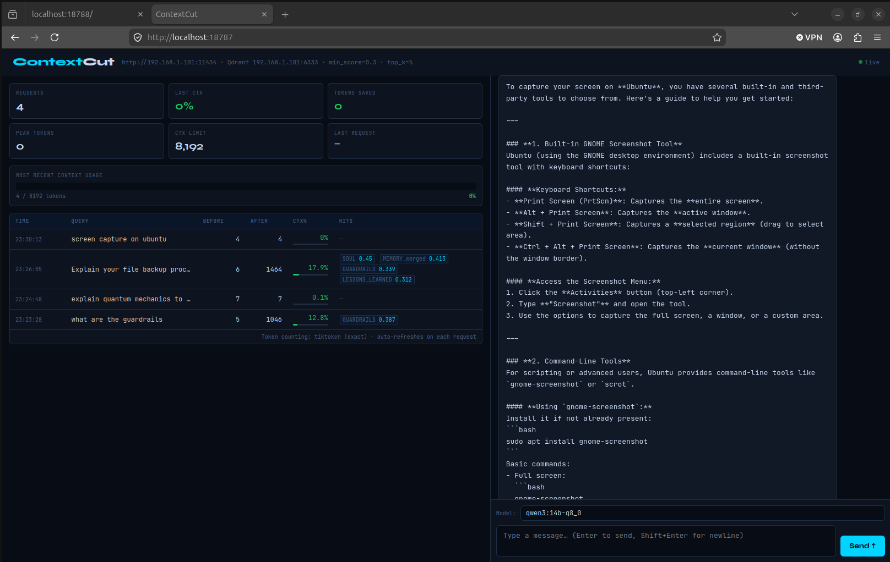

# ContextCut-PRO

**Stop wasting tokens. Inject only what matters.**

ContextCut-PRO is the commercial edition of ContextCut — a transparent semantic RAG proxy for Ollama, OpenClaw, and any OpenAI-compatible local LLM endpoint. Drop it in front of your LLM — zero application changes required.

---

## Quick Install

```bash
curl -fsSL https://raw.githubusercontent.com/StevoKeano/ContextCut/main/install.sh -o /tmp/install.sh
chmod +x /tmp/install.sh
bash /tmp/install.sh
```

---

## Free vs PRO

| Feature                        | Free | PRO |
| ------------------------------ | :--: | :-: |
| Semantic RAG injection         |  ✅  | ✅  |
| MIN_SCORE threshold filtering  |  ✅  | ✅  |
| Ingest + watch mode            |  ✅  | ✅  |
| Basic dashboard                |  ✅  | ✅  |
| Split-panel live dashboard     |  —   | ✅  |
| Integrated streaming chat      |  —   | ✅  |
| Per-message token analytics    |  —   | ✅  |
| Ollama model selector          |  —   | ✅  |
| Commercial usage rights        |  —   | ✅  |
| Priority support               |  —   | ✅  |
| Advanced context-cutting rules |  —   | ✅  |

---

## Why ContextCut

Most RAG implementations stuff your entire knowledge base into every prompt. ContextCut uses vector similarity to inject **only the chunks that are actually relevant** to each query — and skips injection entirely when nothing scores above your threshold.

| Query                      | Without ContextCut       | With ContextCut               |
| -------------------------- | ------------------------ | ----------------------------- |
| "What are the guardrails?" | 3,000+ tokens (all docs) | 806 tokens (1 relevant chunk) |
| "Explain quantum physics"  | 3,000+ tokens (junk)     | ~5 tokens (nothing relevant)  |

**Result: 50–90% token reduction on real workloads.**



---

## Requirements

- Python 3.10+
- [Voyage AI API key](https://dash.voyageai.com) (free tier works)
- [Qdrant](https://qdrant.tech) running locally or on your LAN
- Ollama or any OpenAI-compatible LLM endpoint
- See [LICENSE-PRO.md](LICENSE-PRO.md) for full terms

---

## Install

```bash
curl -fsSL https://raw.githubusercontent.com/StevoKeano/ContextCut/main/install.sh -o /tmp/install.sh
chmod +x /tmp/install.sh
bash /tmp/install.sh
```

Enter your PRO license key when prompted. On macOS, services are registered as launchd agents and start automatically on login. On Linux, a `start.sh` script is generated.

---

## Configuration

All settings via environment variables:

| Variable                    | Default                  | Description                            |
| --------------------------- | ------------------------ | -------------------------------------- |
| `VOYAGE_API_KEY`            | _(required)_             | Voyage AI API key                      |
| `CONTEXTCUT_UPSTREAM`       | `http://localhost:11434` | Ollama or OpenAI-compatible endpoint   |
| `CONTEXTCUT_QDRANT_HOST`    | `localhost`              | Qdrant host                            |
| `CONTEXTCUT_QDRANT_PORT`    | `6333`                   | Qdrant port                            |
| `CONTEXTCUT_COLLECTION`     | `contextcut`             | Qdrant collection name                 |
| `CONTEXTCUT_KB_DIR`         | `~/contextcut/knowledge` | Knowledge base directory (ingest only) |
| `CONTEXTCUT_PROXY_PORT`     | `18788`                  | Proxy listen port                      |
| `CONTEXTCUT_DASHBOARD_PORT` | `18787`                  | Dashboard port                         |
| `CONTEXTCUT_CTX_LIMIT`      | `8192`                   | Model context window (for % display)   |
| `CONTEXTCUT_TOP_K`          | `5`                      | Max chunks to retrieve                 |
| `CONTEXTCUT_MIN_SCORE`      | `0.30`                   | Minimum relevance threshold (0.0–1.0)  |
| `CONTEXTCUT_MODEL`          | _(empty)_                | Default model pre-filled in dashboard  |

---

## Ingest Tool

```bash
python ingest.py                         # one-shot ingest all .md files
python ingest.py --watch                 # ingest then watch for file changes
python ingest.py --query "guardrails"    # test semantic search
python ingest.py --clear                 # wipe collection and start fresh
```

> **Note:** Voyage AI free tier has rate limits. ContextCut handles this automatically.

---

## Dashboard

Open `http://localhost:18787` to access the PRO split-panel dashboard:

- **Left panel** — live stats cards, context usage bar, and per-request token table with relevance scores. Updates every few seconds without page reload.
- **Right panel** — integrated chat with model selector. Responses stream in as they are generated.

---

## Tuning MIN_SCORE

```bash
python ingest.py --query "your typical query"
```

- Above `0.35` — highly relevant, inject
- `0.20–0.35` — tangentially related, use with caution
- Below `0.20` — noise, skip

Start at `0.30` and adjust for your domain.

---

## License

**Pro License – $29.88 one-time per seat**

ContextCut PRO is proprietary software. Purchase grants a single-seat commercial license.

- Lifetime commercial usage rights
- Priority support
- Advanced context-cutting rules & presets
- Pro dashboard features
- See [LICENSE-PRO.md](LICENSE.md) for full terms

[Buy Pro License →](https://5984630877416.gumroad.com/l/ContextCut-Pro)

> Note: This is the local AI context optimizer for Ollama + Qdrant. There is another unrelated public repo with a similar name — this is the PRO edition.
